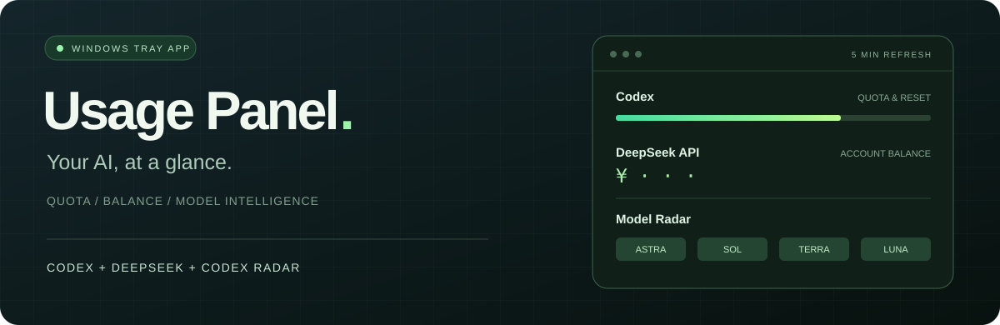
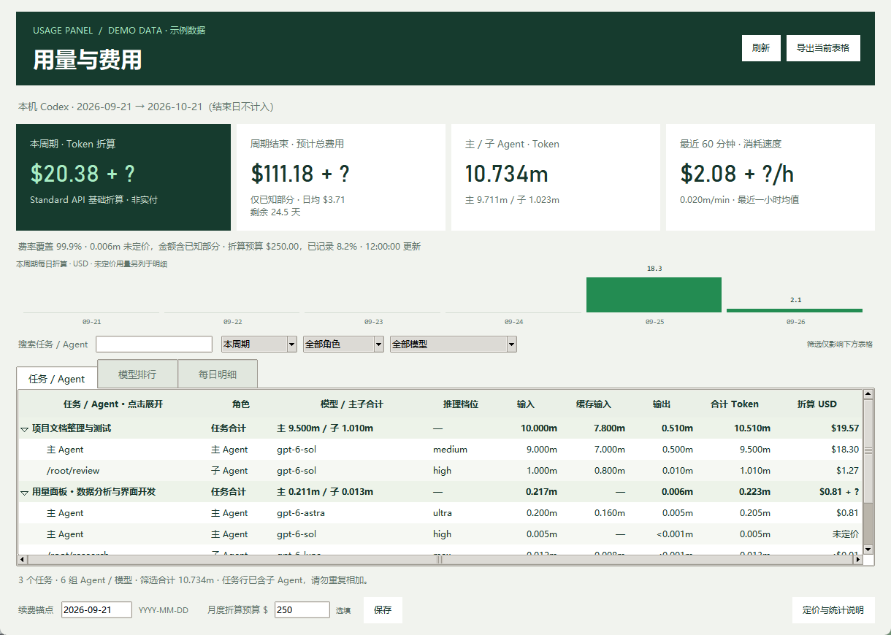

<div align="center">



### 额度 · 月度费用 · Agent 用量 · 模型评分。

让 **Codex、DeepSeek API 和 Codex Radar** 待在桌面一角，随时查看。

[](https://github.com/viceleeland/usage-panel/actions/workflows/tests.yml)


[快速开始](#quick-start) · [功能一览](#features) · [构建程序](#build) · [使用说明](使用说明.md)

<sub>横幅为功能示意，不展示真实账户数据。</sub>

</div>

---

<a id="features"></a>



<sub>界面使用合成示例数据；金额为 API 基础 Token 折算，非实际账单。</sub>

## 🟢 小面板，三种视角

| **01 / CODEX** | **02 / DEEPSEEK** | **03 / MODEL RADAR** |
| :--- | :--- | :--- |
| **还剩多少额度？** | **API 账户还有多少余额？** | **各档位表现如何？** |
| 官方额度、重置卡、日用量；本机月度费用与主 / 子 Agent 明细。 | 读取 Claude Code 中的 DeepSeek API 配置，显示官方余额和本机今日 token。 | Astra、Sol、Terra、Luna，按推理档位对照社区评测。 |

### 日常使用，保持轻巧

- **账户、官方日统计与评分每 5 分钟刷新**；本机 token 和缓存明细每 10 秒增量更新，隐藏后也持续读取。
- **近 7 天趋势图**，从 SUMMARY 旁打开：Codex 使用官方返回的日期与总量；DeepSeek 使用本机日志，单位为 m。
- **今日实时可见**：主面板「本机今日」始终显示本机实时计数，官方已报值单独显示并标明可能延迟；底部分别显示额度与本机读取时间。
- **趋势图官方优先**：Codex 今日已有官方值时使用官方值；未返回时，橙色 `≈` 柱表示今日本机暂估，不计入官方合计。过去日期缺失显示 `—`。
- **低额度通知**，默认开启：Codex 剩余 ≤10%，DeepSeek 余额 ≤¥10 / $1；在「设置 / 说明」关闭。
- **缓存命中率**，面板与明细都显示，按缓存命中 token ÷ 全部输入 token 计算，保留一位小数；当天无输入或记录不完整时显示 `—`。
- **今日用量明细**，分别显示 Codex 与 Claude Code 中 DeepSeek 的输入、输出和缓存命中。
- **月度费用与 Agent 用量**：按自定续费日统计本周期，展开任务查看主 / 子 Agent、实际模型与推理档位；查看模型排行、每日趋势、近 60 分钟速度和月度折算预算。
- **周期结束预测**：按本周期平均速度外推；费用不全时显示已知部分和 `+ ?`，未定价 Token 单独列出。表格支持搜索、筛选及 CSV / JSON 导出。
- **重置卡一眼可见**，显示官方可用数量、最近到期日，点击「明细」查看已返回的到期时间。
- **关闭即隐藏到托盘**，支持面板置顶。
- **旧数据明确标记**，查询失败不会伪装成新结果。
- **只读查询**，不发起模型对话，不消耗重置卡，不切换你的服务配置。

> [!NOTE]
> 进度条显示的是**剩余比例**。账户未返回的额度窗口不会显示，也不会被当成 0% 或 100%。

<a id="quick-start"></a>

## ⚡ 快速开始

准备 **Windows 10 / 11 + Python 3.12**，在 PowerShell 中运行：

```powershell
git clone https://github.com/viceleeland/usage-panel.git
cd usage-panel
py -3.12 -m venv .venv
.\.venv\Scripts\python.exe -m pip install -r requirements.txt
.\.venv\Scripts\python.exe source\app.py
```

**连接你的数据：**

| 数据 | 准备工作 |
| :--- | :--- |
| Codex | 本机安装 Codex CLI，并完成登录。 |
| DeepSeek | Claude Code 已配置官方 DeepSeek API，或设置 `DEEPSEEK_API_KEY` 环境变量。 |
| Codex Radar | 无需账户，自动读取公开评测数据。 |

### 随手就能用

| 操作 | 效果 |
| :--- | :--- |
| `Ctrl + R` | 立即刷新 |
| `Esc` / 关闭窗口 | 隐藏到托盘，继续自动更新 |
| 单击绿色托盘图标 | 重新显示面板 |
| 右键托盘图标 | 刷新或退出 |
| 勾选「置顶」 | 面板保持在其他窗口上方 |

## 月度费用与 Agent 用量

打开「用量与费用」，在「续费锚点」填写自己的续费日期（`YYYY-MM-DD`）并保存。程序沿用该日期的日号，按本地时区统计每月周期：从起始日零点开始，到下月同日零点结束，结束日不计入。月底不足原日号时使用当月最后一天，下个月恢复原日号。这里不使用 5 小时或每周额度的重置时间推测订阅日期。

| 视图 | 显示内容 |
| :--- | :--- |
| 本周期概览 | 已记录 Token 折算金额、周期结束预测、主 / 子 Agent Token、最近 60 分钟消耗速度。 |
| 任务 / Agent | 任务合计与可展开的 Agent 明细；同一个 Agent 切换模型或推理档位时分行显示实际用量。 |
| 模型排行 | 按模型及推理档位汇总输入、缓存输入、输出、Token 占比与折算金额。 |
| 每日趋势与明细 | 本周期本机每日记录；图中金额只含已定价部分，未定价 Token 在明细中保留。 |
| 预算与导出 | 可选的月度美元折算预算；导出当前标签页和当前筛选结果为 CSV 或 JSON。 |

任务合计已经包含子 Agent，不能再和展开的明细相加。角色或模型无法辨认时保留为未知；标题仅来自本机会话索引，不从聊天正文提取。表格可按任务 / Agent 搜索，并按模型、角色和时间范围筛选；筛选不改变上方周期概览。今日、最近 7 天的筛选也只覆盖当前载入的月度周期。

**费用是 Standard API 基础 Token 折算，不是 ChatGPT / Codex 订阅实际账单。** 当前费率核验于 **2026-09-26**，历史记录也按这套费率重算；来源为 [OpenAI API 定价](https://developers.openai.com/api/docs/pricing)及各模型页。ChatGPT credits、订阅已含额度和 API 收费口径不同，不能把额度消耗百分比当成美元费用比例。相关说明见 [Codex 定价](https://learn.chatgpt.com/docs/pricing)与 [Speed](https://learn.chatgpt.com/docs/agent-configuration/speed)。

- 缓存读取属于输入，推理 Token 属于输出，不重复加总；`ultra` 等推理档位按日志展示，不额外乘虚构的单价系数。
- 按单次请求输入判断适用的长上下文价格。模型、缓存计数、单次输入或计价条件无法确认时保留 Token 为未定价，不补成零费用。
- 不计无法确认的 Fast 等服务档位差价、缓存写入溢价和工具 / 图像等费用。只统计本机留存日志，可能缺少其他设备、云任务及已删除记录。
- **预计费用 = 本周期已记录折算 ÷ 已过时间 × 完整周期时长**，按实际日历月计算。未满 24 小时、没有可定价用量或读取不完整时不预测；有未定价 Token 时仅显示“已知部分预计”并加 `+ ?`。未来使用节奏变化会改变结果。
- 近 60 分钟速度按最近一小时的已记录用量计算；预算用于对照折算金额，不会限制调用、自动充值或改变订阅。
- CSV / JSON 包含当前筛选的汇总明细、任务名称及标识，不含聊天正文；导出文件由用户选择保存位置。

<a id="build"></a>

## 📦 打包成独立程序

```powershell
.\.venv\Scripts\python.exe -m pip install -r requirements-dev.txt
.\.venv\Scripts\python.exe build.py
```

生成 **`dist/UsagePanel.exe`**，双击即可运行，无需另装 Python。

程序仍需读取本机 Codex 登录及 DeepSeek 配置；运行后在旁边创建 `data/` 文件夹。默认不开机自启。当前仓库提供源码与构建脚本，未发布预编译下载包。

## 🧠 Astra 与模型评分

**六个档位，一张表：**

`ultra` → `max` → `xhigh` → `high` → `medium` → `low`

| 视图 | 含义 |
| :--- | :--- |
| **综合智能** | 软件工程与视觉空间两个维度，按有效题量加权。 |
| **软件工程** | 软件工程基准成绩。 |
| **视觉空间** | 视觉空间推理基准成绩。 |

> [!IMPORTANT]
> IQ 来自 [Codex Radar](https://codexradar.com/) 的**社区基准评分**，并非人的智商，也不是模型厂商的官方评级。缺失档位显示 `—`；任一维度缺失时，不生成综合分。两组来源可能不同步，面板分别标出更新时间。

## ⏱️ 官方统计和本机实时数据

**Codex 历史以官方日统计为准。** 通过 `account/usage/read` 读取日期和 token 总量，直接沿用 `startDate`，不按电脑时区平移。主面板显示最近已报的官方值；趋势图的官方合计只包含当前 7 天范围内实际返回的官方值。官方数据可能延迟，不等同于逐 token 实时计数。

主面板「本机今日」始终显示每 10 秒读取的本机计数，官方值出现、延迟或读取失败都不会遮住它。两种统计口径分开显示，不相加。底部「本机读取」时间随本机读取更新，不依赖账户、余额或评分刷新。

趋势图中，若今天尚未返回官方值，使用本机暂估并明确标注；一旦官方值出现就替换暂估。过去日期缺失显示 `—`，合法的官方零值才显示 `0`。日统计读取失败保留上次成功数据和时间，并标为旧数据，不影响额度与重置卡读取。

**本机明细**（输入、输出、缓存命中率）仍按电脑本地日期统计。DeepSeek 当前也仅有本机 token 记录，因此这些数字不应直接与官方账户总量等同：

- Codex：读取 `CODEX_HOME` 下 `sessions/` 与 `archived_sessions/` 的 token 事件，按累计值差额统计并去重。
- DeepSeek：读取 Claude Code 项目日志中 DeepSeek 模型的用量，按消息 ID 去重；其他 API 客户端的调用不在此范围。
- token 统一以 m（百万）显示，保留三位小数；不足 0.001m 的非零值显示 <0.001m。输入包含缓存读取和创建；缓存命中是输入的子集，不能再加一次。推理 token 已包含在输出中。
- 今日计数启动时补读最近 7 天保留的日志，之后增量读取；跨午夜重新按本地日期统计。月度分析另按配置周期读取并去重单次响应和旧版累计事件，避免重复计算同一次请求或子 Agent 继承的历史。日志缺失或已清理可能导致统计不完整。
- 未找到日志目录显示 `—`；存在目录但当天没有可统计调用显示 `0`。
- 不读取对话正文用于展示，不上传本地用量。月度分析只用已核验的官方单价折算可辨识 Token，明确区分已知金额、未定价部分和实际账单。

### 低额度提醒怎么触发？

随账户数据每 5 分钟检查，也可手动刷新。只使用成功读取的新数据，过期窗口与连接失败不触发提醒。

同一低状态只通知一次；恢复正常后再次降低，或 Codex 进入新的额度周期，才重新提醒。通知状态保存在本机 `data/alert-state.json`，正常重启不会重复通知。Windows 关闭通知或开启勿扰时可能不弹出。默认仅提醒，不自动充值或使用重置卡。

## 🔐 数据留在哪里？

**登录交给原有工具，面板只读取所需信息。**

- DeepSeek 密钥只发送到官方 `api.deepseek.com/user/balance`，不会发送给 Codex Radar。
- 本工具不持久化 API 密钥，也不修改 Claude Code 的服务配置。
- 额度、余额、评分缓存和窗口设置，以及续费锚点和可选折算预算存放于本机 `data/`，已从 Git 排除。
- 公开仓库不包含个人用量、余额截图或运行缓存。

<details>
<summary><strong>展开高级配置</strong></summary>

| 环境变量 | 用途 |
| :--- | :--- |
| `USAGE_PANEL_CODEX_EXE` | 指定非标准位置的 Codex 可执行文件。 |
| `CODEX_HOME` | 指定 Codex 本地会话记录目录，默认 `~/.codex`。 |
| `CLAUDE_CONFIG_DIR` | 指定 Claude Code 配置目录。 |
| `DEEPSEEK_API_KEY` | 优先使用此变量中的 DeepSeek 密钥。请勿提交真实密钥。 |

</details>

<details>
<summary><strong>展开测试与项目结构</strong></summary>

```powershell
.\.venv\Scripts\python.exe -m unittest discover -s source -p "test*.py"
```

测试无需真实账户或网络请求，覆盖额度窗口、缺失数据、百分比处理、雷达加权算法、密钥发送目标，以及增量 token 统计、7 天历史、缓存口径、去重、跨日行为、低额度提醒、官方日期保留与数据来源选择。月度分析测试覆盖周期边界、月底与闰年、主 / 子 Agent 归属、模型变更、未知计数、长上下文和预测可用条件。

安装运行依赖后，可在 Windows 桌面运行界面回归。它们使用模拟数据，检查原生下拉菜单切换、弹窗关闭和后台读取途中退出：

```powershell
.\.venv\Scripts\python.exe source/ui_regression.py
.\.venv\Scripts\python.exe source/ui_menu_regression.py
```

```text
usage-panel/
├── source/
│   ├── app.py               # 托盘与面板
│   ├── providers.py         # 额度、余额、评分适配器
│   ├── token_usage.py      # 本机今日及 7 天 token 统计
│   ├── usage_analytics.py  # 本周期响应去重、模型与主 / 子 Agent 归属
│   ├── usage_costs.py      # 月度周期、基础费用折算、每日汇总与预测
│   ├── insights_ui.py      # 月度分析窗口、筛选、预算与 CSV / JSON 导出
│   ├── test_usage_analytics.py # 本周期读取与归属测试
│   ├── test_usage_costs.py # 费用、月度周期与预测测试
│   ├── usage_view.py       # 官方优先、缓存及今日暂估规则
│   ├── test_usage_view.py  # 来源选择与未知值测试
│   ├── alerts.py           # 低额度提醒与去重
│   ├── test_alerts.py      # 提醒阈值及状态测试
│   ├── test_tokens.py      # token 统计测试
│   └── test_providers.py    # 无凭据单元测试
├── docs/assets/             # README 视觉资源
├── .github/workflows/       # 自动测试
├── build.py                 # Windows 打包入口
└── 使用说明.md
```

</details>

## 📡 数据来源

| 来源 | 读取内容 |
| :--- | :--- |
| [Codex App Server](https://learn.chatgpt.com/docs/app-server) | `account/rateLimits/read` 额度与重置卡；`account/usage/read` 官方日统计 |
| 本机 Codex / Claude Code 日志 | 留存的调用用量；Codex 月度分析使用响应与会话元数据，不等同于全账户统计 |
| [OpenAI API 定价](https://developers.openai.com/api/docs/pricing) | Standard API 基础 Token 折算费率，核验日期 2026-09-26 |
| [DeepSeek API](https://api-docs.deepseek.com/zh-cn/api/get-user-balance/) | 账户余额，非当天消费统计 |
| [Codex Radar](https://codexradar.com/) | 公开模型评测数据，网站改版时可能需要更新适配器 |

系统进程数不等于活动 AI 任务数。更多操作细节见 [使用说明](使用说明.md)。

## 交互参考

月度报表、消耗速度和任务明细的交互参考了 [ccusage](https://github.com/ccusage/ccusage)、[CodexBar](https://github.com/steipete/CodexBar)、[Claude Code Usage Monitor](https://github.com/Maciek-roboblog/Claude-Code-Usage-Monitor) 和 [codex-usage](https://github.com/zJay26/codex-usage)。本项目自行实现本机读取、费用计算与 Windows 界面，未复制这些项目的代码，也不依赖它们运行。

---

<div align="center">

**少切几个窗口，多看一眼全局。**

[报告问题](https://github.com/viceleeland/usage-panel/issues) · [查看更新](CHANGELOG.md) · [回到顶部](#readme)

</div>
